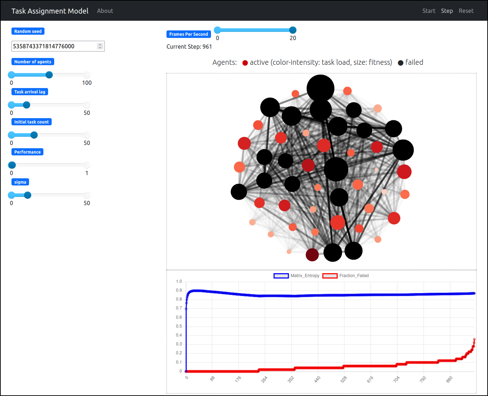

[](https://github.com/CodesByChris/task-assignment-adaptivity/actions/workflows/test-and-lint.yml)
[](https://codecov.io/gh/CodesByChris/task-assignment-adaptivity)


# Systemic Adaptivity in Task-Oriented Teams

Interactive visualization of an agent-based model (ABM) studying how project teams adapt to the loss of overloaded team members.



This model is based on the research paper [*"The Downside of Heterogeneity: How Established Relations Counteract Systemic Adaptivity in Tasks Assignments"*](https://www.mdpi.com/1099-4300/23/12/1677) by Giona Casiraghi, Christian Zingg, and Frank Schweitzer published in the journal *Entropy (2021, 23(12), 1677)*.
Team members are represented as agents, each with their own task-solving capacity.
These agents can either solve tasks or redistribute them to avoid exceeding their capacity.
If that still happens, they drop out, leaving the remaining members to compensate for the lost workforce.
The ABM showcases dangerous failure cascades in teams whose members exhibit significant heterogeneity in their task-solving capacity.


The code builds on [Mesa](https://mesa.readthedocs.io/en/stable/), a Python framework for ABMs, to develop an interactive visualization.
Sliders allow to change model parameters and immediately see how the dynamics and outcomes of team breakdowns are influenced.


## Usage

This repository provides scripts for studying (1) average model dynamics across runs and (2) how each parameter influences the model dynamics.
Both scripts require all packages from `requirements.txt`, which you can install by running `pip install -r requirements.txt`.

1. To study average model dynamics, run:
    ```bash
    jupyter notebook step_01_resilience_analysis.ipynb
    ```

2. To study the effect of model parameters in an interactive Mesa dashboard, run:
    ```bash
    python step_02_dashboard.py
    ```
    - Alternatively, you can run one of the other `step_02*` files, which preset parameter values leading to special outcomes like the collapse of the entire team.


## Tests

This repository uses `pytest` to test the core functionality of the ABM, including the task assignment between agents, network generation, and statistics computation.
To execute the tests, run:
```bash
pytest
```


## Citation

You can cite the publication introducing the ABM:

```
@article{Casiraghi2021downside,
    title={The Downside of Heterogeneity: How Established Relations Counteract Systemic Adaptivity in Tasks Assignments},
    author={Casiraghi, Giona and Zingg, Christian and Schweitzer, Frank},
    journal={Entropy},
    volume={23},
    number={12},
    pages={1--12},
    year={2021},
    article-number={1677},
    doi={10.3390/e23121677},
    url={https://www.mdpi.com/1099-4300/23/12/1677},
}
```


## Contributors

The code in this repository has been developed by

- Christian Zingg
- Giona Casiraghi

at the Chair of Systems Design, ETH Zurich.


## Comments

- The code in this repository is developed independently from the original code of the ABM used for the paper.
    The new implementation uses Mesa to develop interactive visualizations of the ABM.
    In contrast, the original ABM was implemented using base Python, and the plots were created in R with the `dplyr` and `ggplot2` libraries.
    Because the code in this repository utilizes different libraries, the generated plots look slightly different than those presented in the paper.
